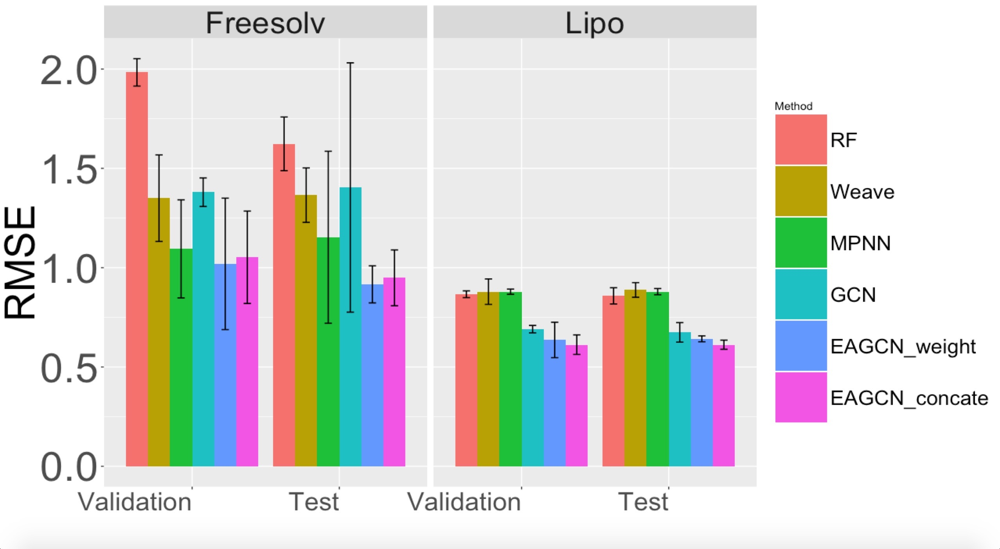
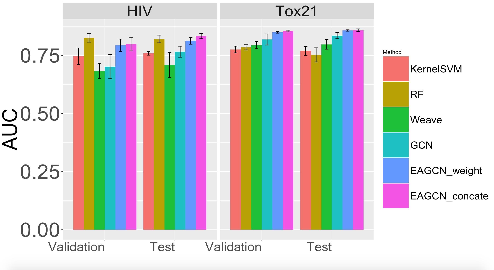

# EAGCN
This is a PyTorch implementation of the paper "Edge Attention based Multi-relational Graph Convolutional Networks", which is submitted to KDD 2018. 

## Installation

Install pytorch and torchvision. 

## Train EAGCN model

### Dataset

Four benchmark datasets ([Tox21, HIV, Freesolv and Lipophilicity](http://moleculenet.ai/datasets-1)) are utilized in this study to evaluate the predictive performance of built graph convolutional networks.  They are all downloaded from the [MoleculeNet](http://moleculenet.ai/) that hold various benchmark datasets for molecular machine learning.

Datasets are also provided in folder "Data".

### Train the model
Open the folder "eagcn_pytorch".

When you train the model for classification tasks, you can use:

    python train.py

When you train the model for regression tasks, you can use:

    python train_reg.py

## Model Structure

### Edge Attention Layer
The process to build the weighted adjacency tensor is:

Edge attention convolution is:

## Experiment Results
Our experiments evaluate the property prediction on standard supervised classification and regression tasks.
We design our experiments with the goals of 1) verifying the improvement of our method compared with baseline methods, and 2) comparing two different architectures of our method.
We adapt two edge attention layers and three fully connected layers for graph classification and regression.

### RMSE for Regression tasks on  Freesolv and Lipo:

### ROC-AUC for Classification tasks on HIV and Tox21:

### Classification Performance on Tox21 Dataset:

## Acknowledgments
Code is inspired by [GCN](https://github.com/tkipf/gcn) and [conv_qsar_fast](https://github.com/connorcoley/conv_qsar_fast)

