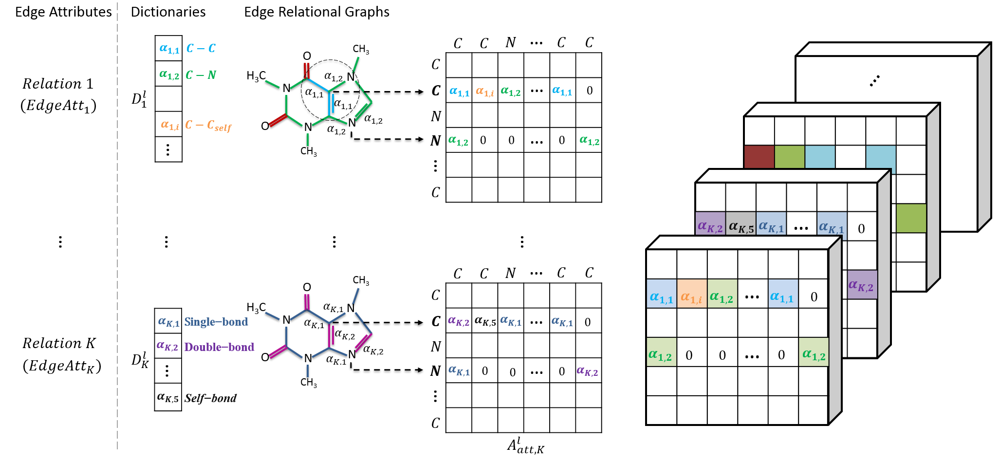

# EAGCN
Implementation of [Edge Attention based Multi-relational Graph Convolutional Networks](https://arxiv.org/pdf/1802.04944.pdf), which is submitted to KDD 2018

## Model Structure
### Attention Layer:
Element Attention Machanism:

Graph Convolution:

## Experiment Result
Classification Performance on Tox21 Dataset

RMSE for Regression tasks on  Freesolv and Lipo:

ROC-AUC for Classification tasks on HIV and Tox21:

## Acknowledgments
Code is inspired by [GCN](https://github.com/tkipf/gcn) and [conv_qsar_fast](https://github.com/connorcoley/conv_qsar_fast)

